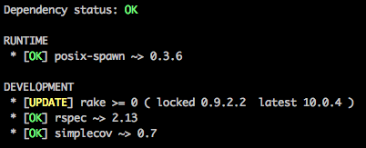

# Dependenci

API wrapper for [Dependenci Service](http://dependenci.com)

## Installation

Add this line to your application's Gemfile:

    gem 'dependenci'

And then execute:

    $ bundle

Or install it yourself as:

    $ gem install dependenci

## Usage

```ruby
require 'dependenci'

status = Dependenci.rubygems(gemfile, gemfile_lock, gemspec)
status = Dependenci.npm(package_json)
```

Example output:

```
{"runtime"=>
  [{"name"=>"coffee-script",
    "required"=>"1.6.2",
    "locked"=>nil,
    "status"=>"ok",
    "latest"=>"1.6.2"},
   {"name"=>"optparse",
    "required"=>"1.0.4",
    "locked"=>nil,
    "status"=>"ok",
    "latest"=>"1.0.4"},
   {"name"=>"scoped-http-client",
    "required"=>"0.9.8",
    "locked"=>nil,
    "status"=>"ok",
    "latest"=>"0.9.8"},
   {"name"=>"log",
    "required"=>"1.3.1",
    "locked"=>nil,
    "status"=>"ok",
    "latest"=>"1.3.1"},
   {"name"=>"express",
    "required"=>"3.1.1",
    "locked"=>nil,
    "status"=>"update",
    "latest"=>"3.2.0"}]}
```

General dependency structure:

- `name`     - Package name
- `status`   - Dependency status
- `required` - Required versions
- `locked`   - Locked version
- `url`      - Package URL (rubygems or npm)

Or use command line tool:

```
dependeci ~/myproject
```

It'll analyze what's being used and print output like this:




## Contributing

1. Fork it
2. Create your feature branch (`git checkout -b my-new-feature`)
3. Commit your changes (`git commit -am 'Add some feature'`)
4. Push to the branch (`git push origin my-new-feature`)
5. Create new Pull Request
